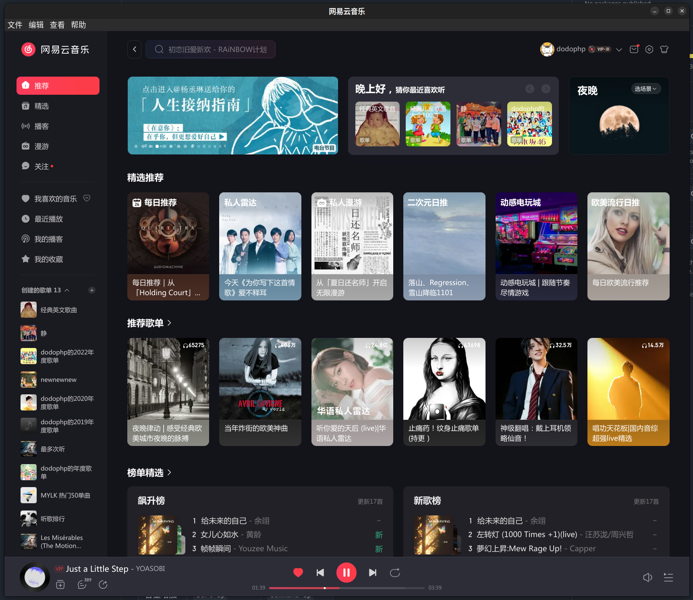
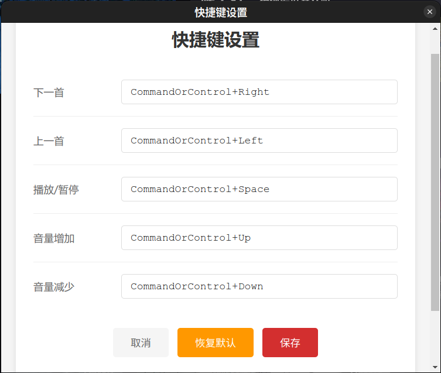

# 网易云音乐 Electron 应用

基于 Electron 框架的网易云音乐桌面应用，支持全局快捷键控制和自定义配置。

## 功能特性

- 🎵 封装网易云音乐网页版为独立桌面应用
- ⌨️ 全局快捷键控制音乐播放（下一首/上一首/播放暂停/音量调节）
- 🎨 可视化快捷键自定义界面
- 💾 快捷键配置持久化保存
- 🔄 支持恢复默认快捷键设置
- 🌍 跨平台支持（macOS, Windows, Linux）
- 🛡️ 安全的上下文隔离和沙箱模式

## 安装依赖

```bash
npm install
```

## 运行应用

```bash
npm start
```

## 构建应用

```bash
# 构建所有平台
npm run build

# 构建特定平台
npm run build:mac    # macOS
npm run build:win    # Windows
npm run build:linux  # Linux
```

## 应用截图

### 主界面



### 快捷键设置



## 快捷键功能

### 默认快捷键

| 操作 | Windows/Linux | macOS |
|------|--------------|-------|
| 下一首 | `Ctrl+Right` | `Command+Right` |
| 上一首 | `Ctrl+Left` | `Command+Left` |
| 播放/暂停 | `Ctrl+Space` | `Command+Space` |
| 音量增加 | `Ctrl+Up` | `Command+Up` |
| 音量减少 | `Ctrl+Down` | `Command+Down` |

### 自定义快捷键

1. 打开应用后，点击菜单栏 **文件** > **设置**（或按 `Ctrl/Command+,`）
2. 在设置窗口中点击要修改的快捷键输入框
3. 按下你想要设置的快捷键组合
4. 点击 **保存** 按钮
5. 重启应用使设置生效

详细说明请查看 [快捷键功能文档](docs/SHORTCUTS.md)

## 项目结构

```
.
├── src/
│   ├── main.js                 # 主进程
│   ├── preload.js              # 预加载脚本
│   ├── renderer.js             # 渲染进程
│   ├── shortcut-manager.js     # 快捷键管理模块
│   ├── settings-window.js      # 设置窗口模块
│   ├── settings-preload.js     # 设置窗口预加载脚本
│   ├── settings-renderer.js    # 设置窗口渲染进程
│   └── settings.html           # 设置界面
├── docs/
│   └── SHORTCUTS.md            # 快捷键功能文档
├── package.json
└── README.md
```

## 技术栈

- **Electron** - 跨平台桌面应用框架
- **electron-store** - 配置持久化存储
- **electron-builder** - 应用打包工具

## 开发说明

### 添加新的快捷键操作

1. 在 `src/shortcut-manager.js` 的 `defaultShortcuts` 中添加默认配置
2. 在 `src/main.js` 中添加对应的处理函数
3. 在 `src/renderer.js` 中实现具体的控制逻辑
4. 在 `src/settings.html` 中添加对应的设置项

### 调试

应用启动后会在控制台输出详细的日志信息，包括：
- 快捷键注册状态
- IPC 消息传递
- 错误和警告信息

## 许可证

MIT
